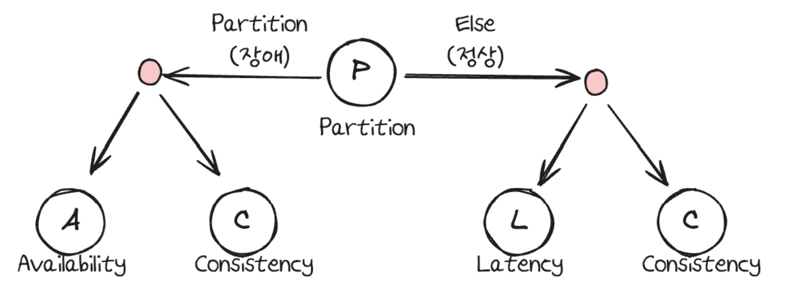

## 데이터베이스

---

<details>
<summary><strong style="font-size:1.17em">Key (기본키, 후보키, 슈퍼키 등등...) 에 대해 설명해 주세요</strong></summary>

```text
키란, 무엇인가를 식별하는 고유한 식별자 입니다.

즉, 키는 데이터베이스에서 조건에 만족하는 관계의 행을 찾거나 
순서대로 정렬할 때 다른 행과 구별할 수 있는 유일한 기준이 되는 속성의 집합입니다.

슈퍼키는
테이블에서 각 행을 유일하게 식별할 수 있는 
하나 또는 그 이상의 속성들의 집합입니다.
예를들면 주민등록번호는 중복되지않고 유일하게 행을 고를수있습니다.

후보키는 
테이블에서 각 행을 유일하게 식별할 수 있는
최소한의 속성들의 집합입니다.
후보키는 기본키가 될 수 있는 후보들이며 
유일성과 최소성을 동시에 만족시켜야 합니다.

기본키는 
후보키들 중에서 하나를 선택한 키로 최소성과 유일성을 만족하는 속성입니다.
테이블에서 기본키는 오직 1개만 지정할 수 있습니다.
기본키는 NULL 값을 절대 가질수 없고, 중복된 값을 가질 수 없습니다.

대체키는
후보키가 두개 이상일 경우 그 중에서 어느 하나를 기본키로 지정하고 남은 후보키들을 대체키라 합니다.

외래키는
테이블이 다른 테이블의 데이터를 참조하여 테이블간의 관계를 연결하는 것입니다.
데이터 조회가 더 쉽고, 다른 테이블의 데이터를 참조할 때 없는 값을 참조할 수 없도록 제약을 주는 것입니다.
참조될(A) 테이블에서 기본키(Primary Key)로 설정해야하고,

참조되는 부모테이블이 먼저 생성된 뒤 데이터를 넣고, 참조하는 자식 테이블이 다음에 생겨야합니다.
또한 부모테이블을 삭제하려면 자식테이블 먼저 삭제한 후 부모테이블을 삭제해야한다.
 

```

</details>

---

<details>
<summary><strong style="font-size:1.17em">기본키는 수정이 가능한가요?</strong></summary>


```text
수정이 가능하긴 하지만, 일반적으로 수정하지 않는 것이 좋습니다.
왜냐하면
기본키는 다른 테이블에서 외래키로 참조될 수 있기 때문에 참조하는 모든 외래키도 수정해야합니다.
이는 데이터 일관성을 해칠 위험성이 큽니다.

하지만 기본키 값을 변경해야 한다면,
보통은 레코드를 새로운 값으로 업데이트하는 대신 
해당 레코드를 삭제하고 새로운 레코드를 삽입하는 방식으로 사용합니다.
```

</details>

---

<details>
<summary><strong style="font-size:1.17em">사실 MySQL의 경우, 기본키를 설정하지 않아도 테이블이 만들어집니다. 어떻게 이게 가능한 걸까요?</strong></summary>

```text
InnoDB는 데이터를 클러스터형 인덱스 순서대로 물리적으로 저장해야합니다.
기본키가 없으면 InnoDB는 클러스터형 인덱스를 위한 대체 키를 찾아야 합니다.

기본키가 없을 경우 다음과 같은 순서로 대체합니다.
먼저, NOT NULL인 UNIQUE 인덱스 중 첫 번째 것을 선택합니다.
그마저도 없다면 6바이트 크기의 숨겨진 Row ID를 자동 생성합니다.
```

</details>

---

<details>
<summary><strong style="font-size:1.17em">외래키 값은 NULL이 들어올 수 있나요?</strong></summary>

```text
참조 테이블의 외래키(Foreign Key) 값은 
명시적으로 NOTNULL을 지정하지 않으면 일반적으로 NULL 값이 들어올 수 있습니다. 
```

</details>

---

<details>
<summary><strong style="font-size:1.17em">어떤 칼럼의 정의에 UNIQUE 키워드가 붙는다고 가정해 봅시다. 이 칼럼을 활용한 쿼리의 성능은 그렇지 않은 것과 비교해서 어떻게 다를까요?
</strong></summary>

```text
UNIQUE 제약조건이 붙으면 자동으로 인덱스가 생성됩니다.

따라서 해당 칼럼을 통해 정렬하거나 검색할때 성능이 좋지만, 

INSERT/UPDATE 작업 시
데이터 입력/수정마다 중복 체크하고, 인덱스 재구성하기 때문에 
성능이 저하됩니다.
```

</details>

---

## RDB와 NOSQL 차이

---

<details>
<summary><strong style="font-size:1.17em">RDB와 NOSQL의 차이에 대해 설명해주세요</strong></summary>

```text
1. 데이터 구조
- RDB: 정해진 스키마에 따라 테이블 형태로 저장하고 행과 열로 구성
- NoSQL: 스키마 없이 자유로운 형태(예: JSON)로 저장 가능

2. 확장성과 일관성
- RDB: ACID를 보장하여 데이터 일관성이 높지만, 서버 간 동기화 문제로 수평적 확장이 어려움
- NoSQL: 데이터 일관성보다 확장성을 우선시하여 수평적 확장이 용이합니다.

3. 데이터 조회
- RDB: 정규화로 인해 데이터 중복은 줄지만, 조회 시 조인 연산이 많이 필요해 성능 저하 가능
- NoSQL: 비정규화된 데이터 구조로 조인 없이 빠른 조회 가능하나 데이터 중복 발생
```

</details>

---

<details>
<summary><strong style="font-size:1.17em">NoSQL의 강점과, 약점이 무엇인가요?</strong></summary>

```text
강점은
스키마를 자유롭게 변경할 수 있어서, 새로운 필드를 추가할 수 있고
중첩된 데이터를 만들기도 가능합니다.

또한,
새로운 서버를 추가하여 확장하기 쉽고 
조인연산없이 빠른 읽기,쓰기가 가능하여 
실시간 처리에 적합합니다.

약점은
데이터 일관성이 부족해 동시에 여러 곳에서 수정시 불일치 발생이 가능합니다.
조인대신에 데이터 중복해서 저장하게되고 따라서 수정시 여러곳에서 수정해야합니다.
```

</details>

---

<details>
<summary><strong style="font-size:1.17em">RDB의 어떠한 특징 때문에 NoSQL에 비해 부하가 많이 걸릴 "수" 있을까요?</strong></summary>

```text
여러 테이블 JOIN 시 메모리와 CPU 사용량 증가합니다.
특히 대용량 테이블 간 JOIN은 성능 저하 가능성이 있을 수 있습니다.
```

</details>

---

<details>
<summary><strong style="font-size:1.17em">NoSQL을 활용한 경험이 있나요? 있다면, 왜 RDB를 선택하지 않고 해당 DB를 선택했는지 설명해 주세요.</strong></summary>

```text
Redis를 JWT 토큰 관리와 이메일 초대 시스템에 활용했습니다.
먼저 토큰 관리에서는, JWT의 무상태성 때문에 발생하는 문제를 해결하기 위해 사용했습니다. 
로그아웃된 토큰을 블랙리스트로 관리하고, Refresh 토큰도 저장했습니다.
또 이메일 초대 시스템에서는 5분간 유효한 초대 코드를 저장하는데 사용했습니다.

RDB 대신 Redis를 선택한 이유는
빈번한 토큰 검증에 인메모리 DB의 빠른 속도가 필요했고
초대 코드같은 임시 데이터는 TTL 기능이 유용했으며
단순 키-값 저장이라 관계형 DB가 오버스펙이었기 때문입니다.
```

</details>

---

## 트랜잭션과 ACID

---

<details>
<summary><strong style="font-size:1.17em">트랜잭션이 무엇이고, ACID 원칙에 대해 설명해 주세요.</strong></summary>

```text
트랜잭션이란, 여러작업들을 하나로 묶은 단위입니다.
ACID는 데이터의 유효성을 보장하기 위한, 트랜젝션의 특징들의 앞글자를 딴 단어입니다.

Atomicity(원자성)은 모든 작업이 반영되거나 모두 롤백되는 특성입니다

Consistency는 데이터가 데이터베이스의 제약조건을 만족하는 상태를 의미합니다.
예를들어 숫자컬럼에 문자열값을 저장이 안되도록 보장해줍니다.

Isolation(고립성)은 A와 B 두개의 트랜젝션이 실행되고 있을 때, A의 작업들이 B에게 보여지는 정도를 의미합니다.

Durability(영구성)은 한번 반영(커밋)된 트랜젝션의 내용은 영원히 적용되는 특성을 의미합니다.
```
</details>

---
<details>
<summary><strong style="font-size:1.17em">ACID 원칙 중, Durability를 DBMS는 어떻게 보장하나요?</strong></summary>

```text
DBMS는 WAL(Write-Ahead Logging)을 통해 Durability를 보장합니다.
트랜잭션의 모든 변경사항을 먼저 로그에 기록하고, 이후에 실제 데이터를 수정하는 방식입니다.

시스템에 장애가 발생하더라도 이 로그를 통해 복구가 가능하기 때문에 커밋된 트랜잭션의 영속성이 보장됩니다.
여기에 체크포인트 메커니즘을 보조적으로 사용해서 복구 시간을 단축하고 메모리를 효율적으로 관리합니다
```

</details>

---

<details>
<summary><strong style="font-size:1.17em">트랜잭션을 사용해 본 경험이 있나요? 어떤 경우에 사용할 수 있나요?</strong></summary>

```text
JIRA 프로젝트에서 이슈 생성 시 트랜잭션을 사용한 경험이 있습니다.

이슈 생성 로직에서:
1. 프로젝트 존재 여부 확인
2. 이슈 데이터 저장 (제목, 내용, 담당자 등)
3. 이슈 히스토리 저장 

이 과정이 모두 하나의 트랜잭션으로 처리되어야 했습니다.
중간에 실패하면 모든 데이터가 롤백되어야 데이터 정합성이 보장되기 때문입니다.
```

</details>

---

<details>
<summary><strong style="font-size:1.17em">읽기에는 트랜잭션을 걸지 않아도 될까요?</strong></summary>

```text
일반적으로 단순 읽기 작업에는 트랜잭션이 필수는 아니지만, 상황에 따라 필요할 수 있습니다

트랜잭션이 필요 없는 경우는
- 단순 조회
- 데이터 일관성이 크게 중요하지 않은 경우

트랜잭션이 필요한 경우는
- Dirty Read 방지가 필요할 때 커밋되지 않은 데이터를 읽는 것을 방지합니다.

Spring에서는 @Transactional(readOnly = true)
로 읽기 전용 트랜잭션을 통해 성능 최적화도 가능합니다.
```

</details>

---

## 트랜잭션 격리레벨

---

<details>
<summary><strong style="font-size:1.17em">트랜잭션 격리 레벨에 대해 설명해주세요.</strong></summary>

```text
READ_UNCOMMITTED 는 다른 트랜잭션의 커밋되지 않은 데이터를 읽을 수 있고, 
Dirty Read, Non-Repeatable Read, Phantom Read 문제가 발생할 수 있습니다.

READ_COMMITTED는 대부분의 DB에서 기본으로 사용하는 격리 수준으로
Dirty Read 방지, 나머지 두 현상 발생 가능합니다.

REPEATABLE_READ는 선행 트랜잭션이 읽은 데이터는 후행 트랜잭션이 수정/삭제하는 것을 막습니다.  
Dirty Read와 Non-Repeatable Read 방지, Phantom Read 발생 가능합니다.

SERIALIZABLE는 모든 현상 방지, 그러나 성능 저하가 가장 큽니다. 
```

</details>

---

<details>
<summary><strong style="font-size:1.17em">모든 DBMS가 4개의 레벨을 모두 구현하고 있나요? 그렇지 않다면 그 이유는 무엇일까요?</strong></summary>

```text
아니요 MySQL은 4개의 레벨을 다 구현하지만 오라클이나 PostgreSQL은
READ UNCOMMITTED를 지원하지 않습니다.
왜냐하면 MVCC를 사용하는 DBMS들은 구조적으로 커밋되지 않은 데이터를 읽을 수 없게 
데이터 일관성을 위해 설계되었습니다.

물론 MySQL도 InnoDB부터 MVCC를 지원하지만
MySQL의 오래된 스토리지 엔진과의 호환성 유지를
위해 READ UNCOMMITTED를 지원하고 있습니다.
```

</details>

---

<details>
<summary><strong style="font-size:1.17em">만약 MySQL을 사용하고 있다면, (InnoDB 기준) Undo 영역과 Redo 영역에 대해 설명해 주세요.
</strong></summary>

```text
InnoDB는 트랜잭션의 ACID를 보장하기 위해 Undo 영역과 Redo 영역을 사용합니다.

Undo 영역은 트랜잭션의 원자성과 일관성을 보장하기 위한 영역입니다. 
데이터가 변경되면 변경되기 전의 데이터를 이곳에 저장합니다. 
이렇게 하면
트랜잭션 롤백 시 이전 데이터로 복원할 수 있고,
트랜잭션 격리 수준을 유지하며 MVCC를 구현할 수 있습니다.

Redo 영역은 지속성을 위해 장애 발생 시 데이터 복구를 위한 영역입니다. 
WAL(Write-Ahead Logging) 방식으로 작동합니다.
트랜잭션이 커밋되면 변경사항을 리두 영역의 로그버퍼와 로그 파일(ib_logfile)에 기록합니다.
 
그리고 실제 변경 데이터는 버퍼 풀에만 있고 디스크의 데이터 파일에는 아직 반영되지 않은 상태입니다.
이렇게 하는 이유는 로그 파일은 순차적 쓰기라 빠르고, 
데이터 파일은 랜덤 I/O라 상대적으로 느리기 때문입니다. 

나중에 체크포인트가 발생하면 버퍼 풀의 데이터를 디스크에 쓰게 됩니다.
만약 체크포인트 전에 서버가 장애가 나도, 재시작 시 Redo 로그를 보고 데이터를 복구할 수 있습니다.
```

</details>

---

<details>
<summary><strong style="font-size:1.17em">그런데, 스토리지 엔진이 정확히 무엇을 하는 건가요?
</strong></summary>

```text
스토리지 엔진이란, 
MySQL에서는 실제 데이터를 디스크 스토리지에 저장하거나 읽어오는 부분을 담당합니다.

InnoDB 엔진 사용시, DML 작업은 ACID 모델을 따르고, 
Commit, Rollback 및 복구 기능을 갖춘 트랜잭션을 제공합니다.
또한, MVCC 구현하고, 버퍼풀을 통한 메모리 캐시도 제공합니다. 

반면 MyISAM을 사용한다면 
테이블 단위 잠금과
트랜잭션을 지원하지 않으므로 읽기 위주의 작업에 적합합니다.
```

</details>

---

## 인덱스 

---

<details>
<summary><strong style="font-size:1.17em">인덱스가 무엇이고, 언제 사용하는지 설명해 주세요.
</strong></summary>

```text
인덱스란 추가적인 저장 공간을 활용하여
데이터베이스 테이블의 검색 속도를 향상시키기 위한 자료구조입니다. 

쉽게 설명하면 책에서 원하는 내용을 찾는다고 하면, 
책의 모든 페이지를 찾아 보는 것은 오랜 시간이 걸립니다. 
그렇기 때문에 책의 저자들은 책의 맨 앞 또는 맨 뒤에 색인을 추가하는데, 
데이터베이스의 index는 책의 색인과 같습니다.

데이터베이스에서도 테이블의 모든 데이터를 검색하면 시간이 오래 걸리기 때문에 
데이터와 데이터의 위치를 포함한 자료구조를 생성하여 빠르게 조회할 수 있도록 돕고 있습니다.

보통 Where절이나 조인이나 OrderBy, GroupBy절에서
자주 사용되는 칼럼에 인덱스를 겁니다.
```

</details>

---

<details>
<summary><strong style="font-size:1.17em">일반적으로 인덱스는 수정이 잦은 테이블에선 사용하지 않기를 권합니다. 왜 그럴까요?
</strong></summary>

```text
인덱스를 항상 정렬된 상태로 유지해야 하기 때문에 
인덱스가 적용된 컬럼에 삽입, 삭제, 수정 작업을 수행하면 추가 작업이 필요합니다.

INSERT는 새로운 데이터에 대한 인덱스를 추가하고,

DELETE는 삭제하는 데이터의 인덱스를 사용하지 않는다는 작업 수행하고,

UPDATE : 기존의 인덱스를 사용하지 않는다는 처리하고,
갱신된 데이터에 대해 인덱스 추가해야합니다.

인덱스를 사용하지 않는다는 처리만 할뿐 제거하는것이 아니기 때문에
추가적인 저장공간이 필요합니다.
```

</details>

---

<details>
<summary><strong style="font-size:1.17em">ORDER BY/GROUP BY 연산의 동작 과정을 인덱스의 존재여부와 연관지어서 설명해 주세요.
</strong></summary>

```text
먼저 ORDER BY 경우,
인덱스가 있을 때는 
이미 정렬된 인덱스를 이용할 수 있어서 
추가 정렬 작업 없이 순차적으로 데이터를 가져올 수 있습니다. 

하지만 여기서 단순히 인덱스가 있다고 해서 무조건 사용되는 것은 아닙니다.
옵티마이저는 비용 기반으로 판단하는데, 
예를 들어 데이터의 20-30% 이상을 가져와야 하는 경우에는 
오히려 테이블 풀스캔 후 정렬하는 것이 효율적일 수 있습니다. 
이는 인덱스를 통해 많은 데이터를 가져올 때 발생하는 랜덤 I/O 비용이 
테이블 풀스캔의 순차 I/O보다 더 비싸기 때문입니다.

인덱스가 없을 때는 MySQL은 filesort라는 것을 사용합니다. 
이는 테이블을 전체 스캔한 후 정렬 버퍼(sort buffer)에 데이터를 담아 정렬하는 방식입니다. 
이때 정렬할 데이터가 정렬 버퍼보다 크면 
임시 파일을 생성해서 처리하게 되는데, 
당연히 디스크 I/O가 발생하므로 성능이 저하될 수 있습니다.

GROUP BY도 비슷한 원리로 동작합니다. 
인덱스가 있으면 이미 정렬된 상태이므로
순차적으로 스캔하면서 그룹핑이 가능하고, 

인덱스가 없다면 해시 테이블을 사용하거나 정렬 후 그룹핑을 수행합니다.
```

</details>

---

<details>
<summary><strong style="font-size:1.17em">기본키는 인덱스라고 할 수 있을까요? 그렇지 않다면, 인덱스와 기본키는 어떤 차이가 있나요?
</strong></summary>

```text
기본키는 인덱스라고 할 수 있습니다. 하지만 일반 인덱스와는 차이점이 있습니다.

MySQL InnoDB기준
기본키는 클러스터형 인덱스가 생성되고,
일반인덱스는 논클러스형 인덱스로 구성됩니다.

클러스터형은 데이터 자체가 정렬되어 저장되는 것이고,
논클러스터형은 별도의 공간에 인덱스를 저장하고, 데이터 위치만 가리키는 것을 말합니다.
```

</details>

---

<details>
<summary><strong style="font-size:1.17em">그렇다면 외래키는요?
</strong></summary>

```text
MySQL InnoDB는 외래키 생성 시
자동으로 인덱스가 생성됩니다.
그 이유는 참조무결성 검사를 위해서 입니다.

그리고 MySQL이 아닌 다른 DBMS는 자동으로 인덱스를 생성하지 않을 수 있습니다.
```

</details>

---

<details>
<summary><strong style="font-size:1.17em">인덱스가 데이터의 물리적 저장에도 영향을 미치나요? 그렇지 않다면, 데이터는 어떤 순서로 물리적으로 저장되나요?
</strong></summary>

```text
클러스터형 인덱스만 데이터의 물리적 저장에 영향을 미칩니다.
즉, 클러스터형 인덱스의 순서대로 데이터가 물리적으로 정렬되어 저장합니다.

반면 세컨더리인덱스는 물리적 저장에 영향을 미치지 않습니다.
별도의 공간에 인덱스 페이지로 저장되고 
리프 노드에는 실제 데이터 대신 클러스터형 인덱스(기본키) 값을 가집니다.
```

</details>

---

<details>
<summary><strong style="font-size:1.17em">우리가 아는 RDB가 아닌 NoSQL (ex. Redis, MongoDB 등)는 인덱스를 갖고 있나요? 만약 있다면, RDB의 인덱스와는 어떤 차이가 있을까요?
</strong></summary>

```text
먼저 Redis는 키 밸류 구조라서, 인덱스는 없습니다.
대신 다양한 데이터 구조를 제공합니다.
예를들면 Sorted Set, Hash등을 제공합니다.

몽고디비는 인덱스를 지원하고 
RDB랑 유사한 B-tree 인덱스를 사용합니다.
또한 기본인덱스외에도 지리공간인덱스,텍스트인덱스등도 지원합니다.
```

</details>

---

<details>
<summary><strong style="font-size:1.17em">(A, B) 와 같은 방식으로 인덱스를 설정한 테이블에서, A 조건 없이 B 조건만 사용하여 쿼리를 요청했습니다. 해당 쿼리는 인덱스를 탈까요?
</strong></summary>

```text
복합 인덱스 (A, B)가 있을 때 B조건만으로는 인덱스를 탈 수 없습니다.
A를 먼저 정렬하고 B를 정렬하기 때문에 B를 먼저 찾는다면 인덱스 풀 스캔을 하거나
테이블 풀 스캔을 하게 됩니다.
```

</details>

---

## DB 조인

---

<details>
<summary><strong style="font-size:1.17em">DB Join이 무엇인지 설명하고, 각각의 종류에 대해 설명해 주세요
</strong></summary>

```text
INNER JOIN은 양쪽 테이블에 모두 매칭되는 데이터만 조회합니다.

LEFT (OUTER) JOIN은 
A 테이블의 모든 데이터 와 A와 B 테이블과 매칭되는 데이터입니다.
만약 B에 매칭되는 데이터가 없으면 NULL로 표시합니다.

RIGHT (OUTER) JOIN은
B 테이블의 모든 데이터 + A 테이블과 매칭되는 데이터입니다.

CROSS JOIN은
양쪽 테이블의 모든 조합인 (카테시안 곱) 입니다.
```

</details>


---

<details>
<summary><strong style="font-size:1.17em">
사실, JOIN은 상당한 시간이 걸릴 수 있기에 내부적으로 다양한 구현 방식을 사용하고 있습니다. 그 예시에 대해 설명해 주세요.
</strong></summary>

```text
NL Join은
중첩된 반복문과 유사한 방식으로 조인을 수행합니다. 
외부 테이블(Outer Table)을 순차적으로 스캔
각 외부 행에 대해 내부 테이블 전체를 스캔하여 매칭되는 행을 찾습니다.

선행테이블의 크기가 작을수록, 내부 테이블에 좋은 인덱스가 있을 때, 조인 결과가 적은 경우
사용하기 좋습니다.

Sort Merge Join은
두 테이블을 정렬 후 순차적으로 스캔하며 병합하는 방식입니다.

HASH 조인은 작은 테이블을 해시 테이블로 만들고, 큰 테이블을 스캔하며 매칭되는 행을 찾는 방식입니다.
```

</details>

---

<details>
<summary><strong style="font-size:1.17em">
그렇다면 입력한 쿼리에서 어떤 구현 방식을 사용하는지는 어떻게 알 수 있나요?
</strong></summary>

```text
Explain Analyze를 사용하면 확인할 수 있습니다.
```

</details>

---

<details>
<summary><strong style="font-size:1.17em">
앞 질문들을 통해 인덱스의 중요성을 알 수 있었는데, 그렇다면 JOIN의 성능도 인덱스의 유무의 영향을 받나요?
</strong></summary>

```text
네, 인덱스가 없다면 JOIN은 테이블 풀 스캔을 하게 됩니다.

예를들어 Nested Loop Join은 인덱스가 있는 경우, 내부 테이블 검색이 매우 빠르지만
없다면 테이블 전체 스캔이 필요해 성능이 매우 저하됩니다.

Merge Join은 정렬된 인덱스가 있는 경우
별도 정렬 과정 불필요해 매우 효율적인 처리 가능합니다. 
```
</details>

---

<details>
<summary><strong style="font-size:1.17em">
3중 조인 부터는 동작 방식이 약간 바뀝니다. 어떻게 동작하는지, 그리고 그 방식이 성능에 어떠한 영향을 주는지 설명해 주세요.
</strong></summary>

```text
3중 조인부터는 중간 결과 집합이 생성되고, 
이 중간 결과와 다음 테이블 간의 조인이 발생하는 방식으로 동작합니다.

예를 들어 A, B, C 테이블을 조인한다고 하면, 먼저 A와 B를 조인한 중간 결과가 만들어지고, 
이 결과와 C 테이블이 조인되는 식입니다. 
이때 옵티마이저는 여러 가능한 조인 순서들을 평가하여 최적의 순서를 결정합니다.

이러한 방식은 
중간 결과 집합의 크기가 매우 중요해집니다. 
예를 들어 A와 B를 조인했을 때 매우 큰 중간 결과가 생성된다면,
 이것과 C 테이블을 조인하는 비용이 매우 커지게 됩니다.
 
또한 조인 순서가 성능을 좌우합니다. 작은 결과를 먼저 만들어내는 조인 순서가 유리한데, 
이는 후속 조인의 처리할 데이터량을 줄여주기 때문입니다.

따라서 3중 조인 이상에서는 적절한 인덱스 설계와 함께, 
WHERE 절의 필터 조건을 최대한 활용하여 중간 결과 집합을 작게 유지하는 것이 중요합니다.
```


</details>

---

## 정규화

---

<details>
<summary><strong style="font-size:1.17em">
정규화가 무엇인가요?
</strong></summary>

```text
정규화는 데이터베이스 설계에서 중복을 최소화하고 데이터 무결성을 보장하기 위한 과정입니다.
```
</details>

---

<details>
<summary><strong style="font-size:1.17em">
정규화를 하지 않을 경우, 발생할 수 있는 이상현상에 대해 설명해 주세요.
</strong></summary>

```text
삽입,삭제,수정 이상이 발생할 수 있습니다. 그 문제를 제 1정규형, 제 2정규형, 제 3정규형으로 해결합니다.
```

</details>

---

<details>
<summary><strong style="font-size:1.17em">
이상현상 이 뭐고 종류가 뭐가있는지?
</strong></summary>

```text
삽입이상은 
데이터 삽입 시 원하지 않는 데이터까지 함께 삽입해야하는 문제입니다.
예를들어, 학생과 수업 테이블이 같은 테이블에 있을 때 학생이 듣는 수업이 없을 때
가짜 수업이나 null을 추가해야하는 문제가 발생합니다.

삭제 이상은 
데이터 삭제 시 원하지 않는 데이터까지 삭제해야하는 문제입니다.
예를들어, 교수와 과목이 같은 테이블에 있다면
과목이 삭제될때 교수도 함께 삭제되어야하는 문제가 발생합니다.

수정이상은
데이터 수정 시 일부만 수정되어 불일치가 발생하는 문제입니다.
예를들어, 직원 부서명이 같이 있을 때
부서명을 수정하면 같은 부서에 속한 직원들의 부서명도 수정해야하는 문제가 발생합니다.

```

</details>


---

<details>
<summary><strong style="font-size:1.17em">
각 정규화에 대해, 그 정규화가 진행되기 전/후의 테이블의 변화에 대해 설명해 주세요.
</strong></summary>

```text
제1 정규화란 테이블의 컬럼이 원자값을 갖도록 테이블을 분해하는 것입니다.

제 2정규형은 부분 함수 종속을 제거하는 것입니다.
즉, 기본키의 일부분만으로 다른 컬럼을 결정하는 것을 제거합니다.

제 3정규형은 이행적 함수 종속을 제거하는 것입니다.
이행적 함수 종속이란 A->B, B->C일 때 A->C를 제거하는 것입니다.
```

</details>

---

<details>
<summary><strong style="font-size:1.17em">
정규화가 무조건 좋은가요? 그렇지 않다면, 어떤 상황에서 역정규화를 하는게 좋은지 설명해 주세요.
</strong></summary>

```text
정규화는 데이터 무결성을 보장하고 중복을 최소화하기 위한 과정이지만,
조인 연산이 많이 필요하고, 성능 저하를 가져올 수 있습니다.

따라서 조회가 많은 테이블이나,
데이터의 변경이 적은 테이블은 역정규화를 고려할 수 있습니다.
```

</details>

---

## B 트리

---

<details>
<summary><strong style="font-size:1.17em">
 B-Tree와 B+Tree에 대해 설명해 주세요.
</strong></summary>

```text
B-트리는 모든 노드에 데이터와포인터를 저장하지만,
B+트리는 오직 리프노드에만 데이터와포인터 저장하고 
내부노드는 인덱스 역할만 합니다.

또한,B+트리는 리프노드들이 LinkedList처럼 서로 연결되어 있으므로
순차검색이 빠릅니다. 
```

</details>

---

<details>
<summary><strong style="font-size:1.17em">
 그렇다면, B+Tree가 B-Tree에 비해 반드시 좋다고 할 수 있을까요? 그렇지 않다면 어떤 단점이 있을까요?
</strong></summary>

```text
B+트리는 특정 키 하나를 찾을 때도 무조건 리프노드까지 내려가야 하지만,
B-트리는 간 노드에서도 데이터를 찾을 수 있어 더 빠를 수 있습니다.

또한 B+트리는 모든 키가 리프노드에 중복되어 저장되야하므로
내부노드의 키가 리프노드에도 있어야 합니다.
B-트리는 중복 저장이 없습니다.

단일 검색이 대부분이고 공간이 중요한 경우 B-트리가 유리합니다.
```

</details>

---

<details>
<summary><strong style="font-size:1.17em">
DB에서 RBT를 사용하지 않고, B-Tree/B+Tree를 사용하는 이유가 있을까요?
</strong></summary>

```text
이유는 디스크 I/O 접근 횟수 차이입니다.
RBT는 하나의 노드에 하나의 데이터만 저장할 수 있어서 트리의 높이가 깊어지는데요. 
반면 B-Tree는 하나의 노드에 여러 데이터를 저장할 수 있어 
같은 양의 데이터를 보다 낮은 높이로 저장할 수 있습니다.

이 말은 노드마다 한번의 디스크 I/O가 발생한다면,
B-Tree는 한 번의 디스크 I/O로 여러 데이터를 한꺼번에 읽을 수 있어서, 
디스크 접근 횟수를 최소화할 수 있습니다.

즉, RBT와 B-Tree 모두 O(logN)이지만 
실제 디스크에 접근하는 횟수는 B-Tree가 훨씬 적어서 성능상 이점이 큽니다.
```

</details>

---

<details>
<summary><strong style="font-size:1.17em">
오름차순으로 정렬된 인덱스가 있다고 할 때, 내림차순 정렬을 시도할 경우 성능이 어떻게 될까요? B-Tree/B+Tree의 구조를 기반으로 설명해 주세요.
</strong></summary>

```text
B-Tree의 경우, 단일 검색은 효율적이지만 순차 접근에서는 비효율적입니다. 
오름차순이든 내림차순이든, 각 값에 접근할 때마다 중위순회를 통해 탐색하기 때문입니다.

반면 B+Tree는 모든 데이터가 리프노드에 있고, 이 리프노드들이 LinkedList처럼 서로 연결되어 있습니다.
따라서 첫 번째 값을 찾은 후에는 리프노드의 연결을 따라가기만 하면 되므로, 
오름차순이나 내림차순 모두 효율적인 순차 접근이 가능합니다.
```

</details>

---

## 커넥션 풀

---

<details>
<summary><strong style="font-size:1.17em">
DB의 Connection Pool에 대해 설명해 주세요.
</strong></summary>


```text
Connection Pool은 
데이터베이스 연결(Connection) 객체들을 미리 생성하여 pool로 관리하는 것입니다
애플리케이션에서 DB 연결이 필요할 때마다 
pool에서 연결을 가져다 쓰고 반환하는 방식으로 동작합니다
```

</details>

---

<details>
<summary><strong style="font-size:1.17em">
DB와 Client가 Connection을 어떻게 구성하는지 설명해 주세요.
</strong></summary>

```text
먼저, TCP/IP 연결 과정을 통해 연결을 맺습니다.
1) Client가 DB 서버의 IP:Port로 TCP/IP 연결 요청
2) DB 서버의 Listener가 요청을 수신
3) 3-way handshaking으로 TCP 연결 수립


그리고 DB 인증 및 세션 생성 과정

1) Client가 사용자 인증 정보 전송 (username, password)
2) DB 서버가 인증 정보 검증
3) 인증 성공 시 서버에서 세션 생성
4) 세션 ID를 Client에게 반환


```

</details>

---

## 테이블풀스캔,레인지스캔..

---

<details>
<summary><strong style="font-size:1.17em">
Table Full Scan, Index Range Scan에 대해 설명해 주세요.
</strong></summary>

```text

테이블 풀스캔:
- 순차적 I/O로 데이터 파일 블록을 연속해서 읽음
- 멀티블록 I/O로 한 번에 여러 블록 읽기 가능
- 대량 데이터 처리시 효율적

인덱스 레인지 스캔:
- 인덱스를 사용하여 조건에 맞는 범위의 데이터만 액세스
- B-Tree 인덱스 구조를 활용
- 인덱스 선두 칼럼이 조건절에 있어야 적용되고
- 랜덤 I/O 발생합니다.

```

</details>

---

<details>
<summary><strong style="font-size:1.17em">
가끔은 인덱스를 타는 쿼리임에도 Table Full Scan 방식으로 동작하는 경우가 있습니다. 왜 그럴까요?
</strong></summary>

```text
인덱스를 사용하면 랜덤 I/O가 발생할 수 있어, 많은 양의 데이터를 읽을 때 오히려 성능이 떨어질 수 있습니다.
옵티마이저 판단하에 전체 테이블을 순차적으로 읽는 것이 더 빠르다고 판단할 경우
테이블 풀 스캔을 진행합니다.
```

</details>

---

<details>
<summary><strong style="font-size:1.17em">
COUNT (개수를 세는 쿼리) 는 어떻게 동작하나요? 
COUNT(1), COUNT(*), COUNT(column) 의 동작 과정에는 차이가 있나요?
</strong></summary>

```text
전체 행 수가 필요하면 COUNT(*)
COUNT(1)은 COUNT(*)와 동일하므로 굳이 사용할 필요 없음

NULL을 제외한 특정 컬럼의 행 수가 필요하면 COUNT(column).
```

</details>

---

## 락

---

<details>
<summary><strong style="font-size:1.17em">
DB Locking에 대해 설명해 주세요.
</strong></summary>

```text
락은 동시성 제어를 위해 사용되는 기술로, 
데이터베이스에서 여러 트랜잭션이 동시에 데이터를 읽거나 쓰는 것을 제어합니다.
```

</details>

---

## SQL 인젝션

---

<details>
<summary><strong style="font-size:1.17em">
SQL Injection에 대해 설명해 주세요
</strong></summary>

```text
공격자가 입력폼에 악위적으로 조작된 쿼리를 삽입하여 
데이터베이스 정보를 불법적으로 열람하거나 조작할 수 있는 취약점입니다.
```

</details>

---

<details>
<summary><strong style="font-size:1.17em">
SQL Injection 방어 및 방지 방법
</strong></summary>

```text
입력값 검증을 하고, Prepared Statement를 사용합니다.
또한 DB관련 에러는 사용자에게 노출되지 않도록 로그를 찍고 ,
사용자에게는 일반적인 에러를 반환하도록
합니다.
```

</details>

---

## 분산시스템

---

<details>
<summary><strong style="font-size:1.17em">
CAP 이론에 대해 설명해주세요
</strong></summary>

```text
분산 시스템에서 일관성, 가용성, 분할 허용성을 모두 동시에 만족할 수 없다는 이론입니다.

일관성이란, 
모든 노드가 같은 시간에 같은 데이터를 보여줘야 합니다.

가용성은
모든 요청에 대해 정상적인 응답을 해야 합니다.
즉, 노드 일부가 죽어도 다른 노드는 정상 응답해야합니다.

분할 허용성은
네트워크 단절이 일어나도 다른 네트워크는 정상 동작해야합니다.

실제로 적용되는 선택은
CP, AP 중 하나를 선택해야합니다.
```

</details>

---

<details>
<summary><strong style="font-size:1.17em">
PACELC 이론에 대해 설명해주세요
</strong></summary>

```text
CAP 이론은 장애 상황일 때 , CP혹은 AP 둘 중하나를 선택하는 것을 말하는데,
PACELC 이론은 장애 상황이 아닌 정상적인 상황에서의 선택을 말합니다.

PAC은 장애시, 일관성과 가용성 중 어떤 것을 선택할 것인지를 의미합니다.

ELC는 정상상황에서 모든 노드들이 같은 데이터를 보여주는 것을 EC라 하고, 
해당 시스템은 MongoDB가 있습니다.

만약 정상상황에서 속도가 더 중요하면 EL을 선택합니다.
해당 시스템은 Cassandra와 DynamoDB가 있습니다.
```


</details>


---

<details>
<summary><strong style="font-size:1.17em">
DELETE , TRANCATE , DROP의 차이점 
</strong></summary>

```text
DELETE : 
DML이고, 
테이블의 특정 행을 삭제할 수 있고,
트랜잭션 로그를 기록하며 
행 단위로 삭제하므로 상대적으로 느리며
AUTO_INCREMENT 값 유지됩니다.

TRUNCATE :
DDL이고,
데이터만 삭제하고 테이블 구조는 유지합니다.
전체 삭제만 가능하고,
트랜잭션 로그를 기록하지 않으며,
테이블 전체를 한번에 삭제하므로 빠름
AUTO_INCREMENT 값 초기화됩니다.

DROP :
테이블 자체를 삭제합니다.
제약조건,인덱스 모두 삭제합니다.
```

</details>

---

<details>
<summary><strong style="font-size:1.17em">
클러스터링이 뭐죠? 
</strong></summary>

```text
똑같은 구성의 여러대의 서버를 병렬로 연결한 상태를 말합니다

구성방식은 
1. Active-Active 클러스터로, 
[Server A] ↔ 양방향 복제 ↔ [Server B]
- 모든 서버가 동시에 서비스
- 로드밸런싱 가능
- 더 높은 가용성

2. Active-Standby 클러스터는 
[Active Server] → 단방향 복제 → [Standby Server]
- 평소에는 Active만 서비스
- Active 장애시 Standby가 대체
- 자원 낭비가 있지만 관리 쉬움
```

</details>

---

<details>
<summary><strong style="font-size:1.17em">
리플리케이션은 무엇인가요? 
</strong></summary>

```text
리플리케이션은 2대이상의 DBMS를 나눠서 데이터를 저장하는 방식이며
Master/Slave로 구성합니다. 

이렇게 구성하면 가용성과 부하를 분산 시킬 수 있습니다. 
```

</details>

---

<details>
<summary><strong style="font-size:1.17em">
클러스트링이랑 리플리케이션 차이 
</strong></summary>

```text
리플리케이션은 Master-Slave로 구축되고
비동기 방식으로 노드들간의 데이터를 동기화합니다
비동기방식이라 지연 시간이 거의 없고 다만, 데이터가 일관성있는 데이터를
얻지 못할 수도 있습니다.

클러스터링은 여러대의 서버를 병렬로 연결한 상태를 말하며
동기 방식으로 데이터를 동기화합니다.
장점은 1개의 노드가 죽어도 다른 노드가 살아있어, 높은 가용성과
부하분산이 가능합니다.
다만, 여러 노드들간의 데이터를 동기화하는 시간이 필요해
리플리케이션에 비해 쓰기 성능이 떨어집니다.
```

</details>

---

<details>
<summary><strong style="font-size:1.17em">
파티셔닝과 샤딩 차이
</strong></summary>

```text
파티셔닝은 단일 데이터베이스 내에서 테이블을 더 작은 단위로 나누는 것입니다
수평 파티셔닝은 행을 기준으로 나누고, 수직 파티셔닝은 열을 기준으로 나눕니다.
예를 들어 주문 테이블을 연도별로 나누거나, 자주 사용하는 컬럼과 아닌 컬럼을 분리하는 식입니다.

샤딩은 이와 달리 데이터를 물리적으로 다른 데이터베이스 서버로 분산하는 방식입니다. 

즉, 파티셔닝은 단일 DB 내에서 이뤄지지만, 샤딩은 여러 서버에 걸쳐 있습니다.

파티셔닝은 관리가 쉽고 백업이 용이하지만 파티션 간 조인이 어렵습니다. 
샤딩은 수평 확장이 쉽고 처리량이 좋지만 일관성 관리가 어렵습니다.
```

</details>

---


## 옵티마이저

---

<details>
<summary><strong style="font-size:1.17em">
옵티마이저란 
</strong></summary>

```text
옵티마이저는 SQL 쿼리를 실행할 때 가장 효율적인 실행 계획을 선택하는 역할을 합니다.
```

</details>


---

<details>
<summary><strong style="font-size:1.17em">
Explain 요소에 대해 설명해주세요
</strong></summary>

```text
- id
    - 쿼리 실행 계획의 각 단계를 구분하는 번호
        - 하나의 SELECT 문만 있는 경우, 여러 테이블을 조인하는 경우에도 보통 'id'는 1입니다.
    - 일반적으로 'id'가 큰 순서부터 실행됩니다.
    - 같은 'id'를 가진 행들은 위에서 아래로 실행됩니다.
- table
    - 어떤 테이블을 접근을 표시하고 있는 지
- select_type
    - SIMPLE: 단순한 SELECT 문
    - PRIMARY: 서브쿼리를 감싸는 외부쿼리, UNION이 포함될 경우 첫번째 SELECT 문
    - SUBQUERY: 독립적으로 수행되는 서브쿼리 (SELECT,WHERE 절에 추가된 서브쿼리)
    - DERIVED: FROM절에 작성된 서브쿼리
    - UNION: UNION, UNION ALL로 합쳐진 SELECT
- type
    - system: 테이블에 데이터가 없거나 한 개만 있는 경우
    - const: 조회되는 데이터가 단 1건일 때
    - eq_ref: 조인이 수행될 때 드리븐 테이블의 데이터에 PK 혹은 고유인덱스로 단 1건의 데이터를 조회할때
    - ref: eq_ref와 같으나 데이터가 2건이상일경우
    - index: 인덱스 풀 스캔
    - range: 인덱스 레인지 스캔
    - all: 테이블 풀 스캔
- key: 옵티마이저가 선택한 인덱스
- ref: 인덱스를 사용하기 위해 어떤 칼럼을 썼는지
- extra: Extra 필드는 옵티마이저가 동작하는데 대해서 우리에게 알려주는 힌트다. 
이 필드는 EXPLAIN을 사용해 옵티마이저의 행동을 파악할 때 아주 중요하다.
    - Distinct: 중복 제거 시
        - 결과 집합에서 중복된 행을 제거할 때 사용됩니다.
        - 성능에 영향을 줄 수 있으므로 필요한 경우에만 사용해야 합니다.
    - Using where: WHERE 절로 필터 시
        - 쿼리의 WHERE 절을 사용하여 결과를 필터링할 때 나타납니다.
        - 일반적으로 정상적인 동작을 나타냅니다.
    - Using temporary: 임시 테이블 사용 시
        - 쿼리 처리 중 임시 테이블이 생성될 때 나타납니다.
        - DISTINCT, GROUP BY, ORDER BY 등의 연산에서 자주 발생합니다.
        - 대량의 데이터를 처리할 때 성능에 영향을 줄 수 있습니다.
    - Using index: 커버링 인덱스 사용 시
        - 쿼리가 인덱스만을 사용하여 결과를 얻을 수 있을 때 나타납니다.
        - 테이블 데이터에 접근하지 않아도 되므로 매우 효율적입니다.
    - Using filesort: 정렬 시
        - MySQL이 결과를 정렬할 때 나타납니다.
        - 메모리나 디스크에서 추가적인 정렬 작업이 필요함을 의미합니다.
```

</details>

---

<details>
<summary><strong style="font-size:1.17em">
Oracle, Mysql 차이점이 뭐야?
</strong></summary>

```text
오라클은 라이선스 비용이 높지만 MySQL은 무료입니다.

Oracle이 대규모 데이터베이스 처리에 더 적합하고 더 나은 성능을 제공합니다.
Oracle은 MVCC(다중 버전 동시성 제어)를 완벽하게 지원하며 트랜잭션 처리가 더 견고합니다.
 MySQL은 스토리지 엔진에 따라 다른데, InnoDB에서는 MVCC를 지원하지만 MyISAM은 지원하지 않습니다.
 
 또한, Oracle은 더 많은 고급 기능을 제공합니다
 예를들면, PL/SQL 프로시저 등이 있습니다. 
```

</details>

---


<details>
<summary><strong style="font-size:1.17em">
CHAR, VARCHAR  차이점
</strong></summary>

```text
CHAR는 고정 길이 문자열을 저장합니다.
VARCHAR는 가변 길이 문자열을 저장합니다.

CHAR는 검색이 빠르고, 자주 수정되는 데이터에 유리하며
VARCHAR는 저장공간을 절약할 수 있습니다. 디스크 I/O가 적습니다.
```

</details>

---

<details>
<summary><strong style="font-size:1.17em">
BLOB과 TEXT의 차이점
</strong></summary>

```text
BLOB(Binary Large Object)은 이진 데이터를 저장합니다
따라서, 이미지, 비디오, PDF 등의 바이너리 파일을 저장합니다.

TEXT는 문자 데이터를 저장합니다
긴 문자열, 글내용 등의 텍스트 데이터를 저장합니다.

둘 다 데이터가 큰 경우 실제 데이터는 외부에 저장하고 포인터만 로우에 저장합니다.
이로 인해 검색이나 정렬에서는 성능이 떨어질 수 있습니다.
```

</details>

---

<details>
<summary><strong style="font-size:1.17em">
트리거란 
</strong></summary>

```text
트리거(Trigger)는 데이터베이스에서 특정 이벤트가 발생했을 때 자동으로 실행되는 프로시저입니다

이벤트란, INSERT, UPDATE, DELETE 등의 DML문이 실행될 때 발생합니다.

주로 감사(Audit) 로그 기록이나 참조 무결성 유지 등에 사용됩니다.
대신, 디버깅도 어렵고 성능 저하를 가져올 수 있습니다.
```

</details>

---

<details>
<summary><strong style="font-size:1.17em">
옵티마이져 힌트란 
</strong></summary>

```text
옵티마이저 힌트는 쿼리에 대한 실행계획을
개발자가 직접 제어하는 방법입니다.

인덱스힌트나 조인힌트등을 줄 수 있습니다.
```

</details>

---

<details>
<summary><strong style="font-size:1.17em">
인덱스 힌트란 
</strong></summary>

```text
인덱스 힌트는 쿼리 실행 시 옵티마이저가 특정 인덱스를 사용하도록 지정하는 방법입니다

옵티마이저가 비효율적인 실행계획을 선택하거나,
특정 인덱스의 사용이 확실히 성능상 유리할 때
대용량 데이터 처리시 특정 인덱스가 필요할 때 사용합니다.

하지만
잘못된 인덱스 힌트는 성능 저하의 원인이 될 수 있음
실제 업무에서는 먼저 실행계획을 분석하고, 
정말 필요한 경우에만 인덱스 힌트를 사용하는 것이 좋습니다. 
```

</details>