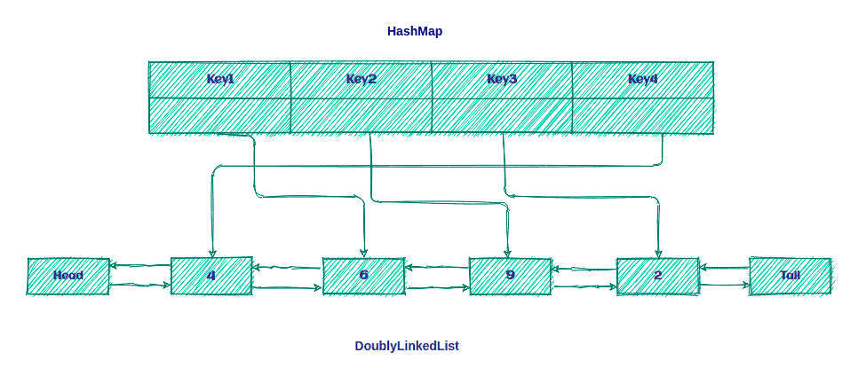

### LRU 캐시란

LRU 캐시는 캐시의 용량이 threshold를 넘었을 때 가장 오랫동안 사용되지 않은 요소가 캐시에서 제거됩니다. 

### LRU 캐시를 구현하기 위해 세운 기준 

1. 모든 작업은 O(1) 으로 실행되야 한다.
2. 캐시의 크기는 제한되어 있다.
3. 모든 캐시작업은 동시성을 지원해야 한다.
4. 캐시가 가득 찬 경우 새 항목을 추가하려면 LRU 전략을 호출해야한다.

### LRU 캐시 구조

**Question 1.**

O(1)에 요소를 읽고, 정렬(시간 정렬), 삭제 작업을 수행할 수 있는 데이터 구조를 어떻게 설계할 수 있을까요?

**Answer 1.**

답을 하기 전에 LRU 캐시와 그 기능에 관해 더 깊이 생각해볼 필요가 있습니다.

- LRU 캐시는 요소에 접근하면(읽거나 수정) 가장 대기열 맨 위로 이동합니다.
- 캐시의 크기가 제한되어있는 특정 용량이 있습니다.
- 새 요소를 가져올 때 마다 대기열의 맨 위에 추가됩니다. 만약 퇴거가 발생하면 대기열의 끝에서 발생합니다.
- 캐시 히트는 O(1)에 이루어져야 하는데 Queue로는 불가능하니, Java의 HashMap 데이터 구조에서는 가능합니다.
- 가장 최근에 사용된 요소 제거는 O(1) 에 수행되어야 합니다. 즉 Queue 구현을 위해 배열 대신 DoublyLinkedList를 사용합니다. 

즉 LRU 캐시는 DoublyLinkedList와 HashMap의 조합 




### 캐시 인터페이스 정의 

```java
public interface Cache<K,V> {
    boolean set(K key, V value);
    Optional<V> get(K key);
    int size();
    boolean isEmpty();
    void clear();
}
```

### 캐시를 나타내는 LRUCache 클래스 정의

```java
public class LRUCache<K,V> implements Cache<K,V> {
    private int size;
    private Map<K, LinkedListNode<CacheElement<K,V>>> linkedListNodeMap;
    private DoublyLinkedList<CacheElement<K,V>> doublyLinkedList;
    
    public LRUCache(int size){
        this.size = size;
        this.linkedListNodeMap = new HashMap<>(size);
        this.doublyLinkedList = new DoublyLinkedList<>();
    }
    
    // 구현..
}

```

이렇게 특정 크기의 LRUCache 인스턴스를 만들수 있게 했습니다. 
이 구현에서는 LinkedListNode에 대한 모든 참조를 저장하기 위해 HashMap 컬렉션을 사용합니다.

이제 LRUCache 작업에 대해 논의해보겠습니다.

### Put Operation

```java
public boolean put(K key, V value) {
    CacheElement<K,V> item = new CacheElement<K,V>(key,value);
    LinkedListNode<CacheElement<K,V>> newNode;
    
    // 캐시 히트한 경우, 업데이트 된 요소로 바꾸고, 리스트 맨 위로 옮기기 
    if(this.linkedListNodeMap.containsKey(key)){
        LinkedListNode<CacheElement<K,V>> node = this.linkedListNodeMap.get(key);
        newNode = doublyLinkedList.updateAndMoveToFront(node, item);
    } else{
        // 새로운 요소인 경우 캐시 사이즈가 꽉 찼는 지 확인
        if(this.size() >= this.size) {
            this.evictElement();
        }
        newNode = this.doublyLinkedList.add(item);
    }
    
    if(newNode.isEmpty()){
        return false;
    }
    
    this.linkedListNodeMap.put(key, newNode);
    return true;
}
```

