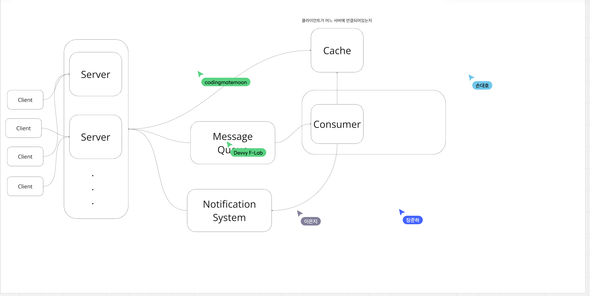
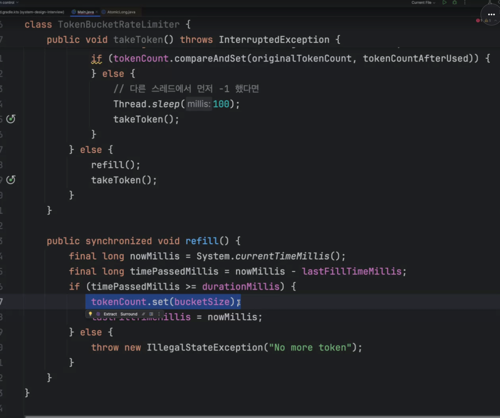

## 시스템 설계 전략 세워본적이 있나?

```text
- 앞으로 어떤 시스템설계를 원하는지 물어보고 사용자 규모랑... 기술 스택을 물어봐야겠구나 생각했습니다.. 설계 자체가 어렵네요...
- 상황에 맞춘 최선의 선택 -> 많이 알아야 대답할 수 있다.
- tps, 용량도 알아야된다. 
- 기간은 어느정도인지, 개발인력은 얼마나 되는지, 개발비용은 얼마인지 등이 환경도 나와야 된다고 생각합니다. 
기능중에서도 어느 기능이 먼저 중요한건지 등을 먼저 알아야 된다고 생각합니다.
```

## 깃헙 이슈 디자인 만들어본다고 가정한다. 어떻게 시스템 설계를 할것인가?

```text
- 사용자 규모를 파악할것 같습니다.
- 요구사항분석, 규모 선정, 
- 설계범위를 좁히자! - 인터뷰어와 감독과 인식을 맞출 필요가 있다.

- 생성조회업데이트를 한다고 가정해보겠습니다. 유저의 수는 천명 정도가 들어와 10~100tps  , write는 10tps 가정하고 기본 crud 구현 및 페이지네이션
- DB 포함 기술 스택을 선정할 것 같다. 
- 이슈를 생성하는 부분과 이슈 조회하는 부분으로 나눠서 전체적인 흐름을 그려볼 것 같습니다.
- 사용자 시나리오를 작성할 것 같습니다

30일 동안 write 10 tps을 가정했을 때 얼마나 쌓일까요?
- 10 * 60 * 60 * 24 * 30 * 10^6 = 86400초 * .. 
 = 1TB 정도 쌓일 것 같습니다.
 

이제 화이트보드 위에 그려볼 것 같습니다.
-> 시스템 아키텍처 설계 
기본적인 LB, WAS, DB, Cache
```

## 링크드인 알림기능을 구현한다 

```text
가장 간단한 방법 
- 사용자가 적을 땐 폴링 방식이 적합해보인다. 왜냐하면 구현이 매우 간단하고, tps도 별로 안나오기 때문에
적절한 캐싱 전략을 사용하면 될 것 같습니다.

- 유저도 많아지고 머물고 있는 유저가 많아진다면 어떻게 할건가
-> 시스템 아키텍처 설계 해보기
- 클라이언트는 특정서버 어디에 붙일지 어떻게 알 수 있을까?
-> 클라이언트가 서버주소를 아는건 힘드니 LB를 사용합니다. 
- 그런데 특정서버에만 부하가 너무 큰 경우 (예를들면 특정 클라이언트 10명만 메시지를 엄청 보낸다ㅡ세션을 특정 서버에 관리할때? 즉 stateful한 경우)
-> 핫스팟 서버에서 부하가 힘들 수 있다.

-> 따라서 우아한 방법이 없을까?
-> 사용자 세션을 저장하는 캐시를 따로 두고
-> 또는 rate-limiting을 걸어서 강제로 웹소켓 재연결 유도 
즉, 라운드로빈을 하는데, 그쪽 웹소켓을 끊는다. -> 다시 한번 시도 ->
->  LB가 어떤서버에 커넥션을 맺을지 질문을 한다.서버1,2,3는 공통 캐시를 사용하여 알고리즘을 사용하여 웹소켓을 커넥션을 선정하는

lb도 확장할 수 있을까? (왜냐면 lb 하나에도 사용가능한 커넥션 수가 한계가 있을 수 있음)
-> gslb를 사용

-> 레디스 펍섭은 단점이 있다.
->  레디스 펍섭을 사용하면 클러스터링한 모든 인스턴스한테 메시지가 간다. 이게 문제가 되는데
그 확장성에 문제가 있다. 확장을 해서 추가 성능을 개선하기 어려워진다.  
```




## Rate limiter

- token bucket: 일정 시간마다 토큰이 발급되는데 해당 토큰을 소모하여 api 를 요청합니다. 소모할 토큰이 없다면 api요청을 차단합니다

간단하게 구현해보자

- 남아있는 토큰 개수에 따라 요청 처리
- 기준 시간이 지나면 토큰 리필 

```java
class TokenBucketLimiter{
    private final long tokenCount;
    private final long lastFillTimeMills;
    private final long bucketSize;
    
    public TokenBucketLimiter(long tokenCount, long lastFillTimeMills, long bucketSize){
        this.tokenCount = tokenCount;
        this.lastFillTimeMills = lastFillTimeMills;
        this.bucketSize = bucketSize;
    }
    
    public void takeToken(){
        final long originalTokenCount = tokenCount.get();
        if(originalTokenCount > 0){
         final long tokenCOuntAfter
        }
    }
}
```


여기서 synchronized가 아니라 reentrant lock을 사용하여 동시성 문제에서 개선포인트가 있다. 


- leaky bucket
- fixed window counter
- sliding window log
- sliding window counter
